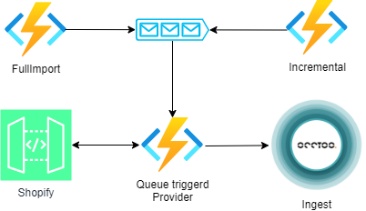

# Shopify Provider 
This project gives an example on how to create a Provider from [Shopify](https://shopify.dev/docs/api) to Occtoo onboarding 

**Docs:** https://docs.occtoo.com/docs/get-started/provide-data

The solution has three function pairs working as shown below:



## Running the app
### 1. Get the code
Clone the repository and open the solution
### 2. Add a localsettings.json file and fill out the details of your project
```json
{
  "IsEncrypted": false,
  "Values": {
    "AzureWebJobsStorage": "UseDevelopmentStorage=true",
    "FUNCTIONS_WORKER_RUNTIME": "dotnet",
    "CRON_TIMER_SETTING_STRING_PRODUCT": "0 0 */3 * *",
    "CRON_TIMER_SETTING_STRING_INVENTORY": "5 4 * * *",
    "CRON_TIMER_SETTING_STRING_LOCATIONS": "5 4 * * *",
    "ApiUrl": "http://www.[mycompany].myshopify.com/admin/api/[DATE_REPLACE]/[FILE_REPLACE]",
    "ApiDateVersion": "2022-10",
    "ProductsUrl": "products.json",
    "LocationsUrl": "locations.json",
    "InventoryUrl": "inventory_levels.json",
    "OcctooSourceProducts": "variant",
    "OcctooSourceInventory": "inventory",
    "OcctooSourceLocations": "locations",
    "OcctooSourceMedia": "media",
    "product-query-items": "product-query-items",
    "locations-query-items": "locations-query-items",
    "inventory-query-items": "inventory-query-items",
    "ListOfProductMediaObjects": "[\"Thumbnail\"]",
    "ShopifyAccessToken": "",
    "DataProviderClientId": "",
    "DataProviderClientSecret": ""
  }
}
```

### 3. Start the application
Hit F5